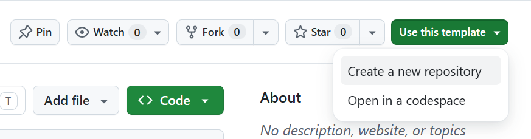

# Setup i uruchomienie

Instrukcja pierwszego uruchomienia projektu lokalnie.

## 1. Generowanie repozytorium

Repozytorium bazowe: **https://github.com/bmxmale/recruitment-task-frontend**



W celu utworzenia repozytorium na swoim koncie skorzystaj z opcji **Use this template**.

Następnie sklonuj utworzone repozytorium korzystajć z polecenia `git clone`

> Uwaga! Utworzone repozytorium musi być publiczne.

## 2. Instalacja zależności

Projekt używa [pnpm](https://pnpm.io/). Jeżeli nie masz go zainstalowanego:

```bash
npm install -g pnpm
```

Następnie:

```bash
pnpm install
```

## 3. Uruchomienie

```bash
pnpm dev
```

Aplikacja będzie dostępna pod `http://localhost:3000`.

Sprawdź, czy oba zdjęcia się ładują:

- `http://localhost:3000/photo/1` — powinno wyświetlić zdjęcie z 11 komentarzami w bazie
- `http://localhost:3000/photo/2` — powinno wyświetlić zdjęcie z 3 komentarzami w bazie

## 4. Build produkcyjny

Przed wysłaniem PR-a upewnij się, że produkcyjny build się buduje bez błędów:

```bash
pnpm build
```

## 5. Testy

Jeżeli dodałeś testy — uruchom je przed wysłaniem PR-a:

```bash
pnpm test
```

Gotowe — przejdź do [`workflow.md`](./workflow.md), żeby dowiedzieć się jak oddać zadanie.
